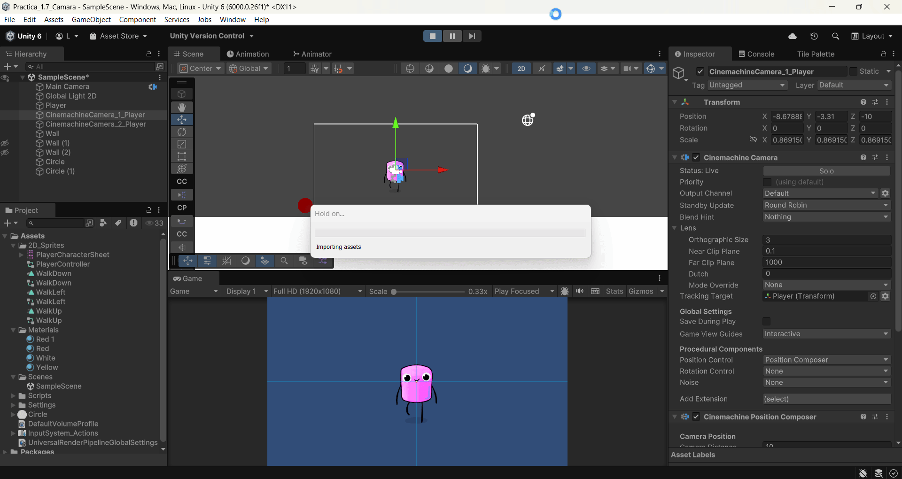
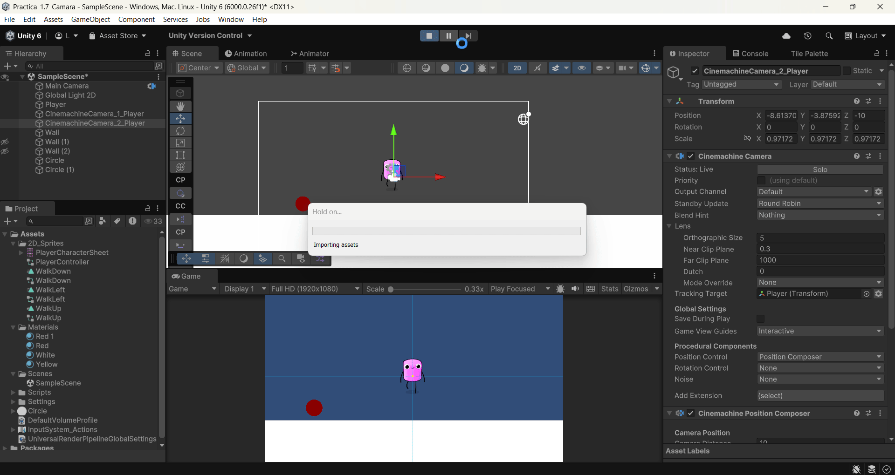
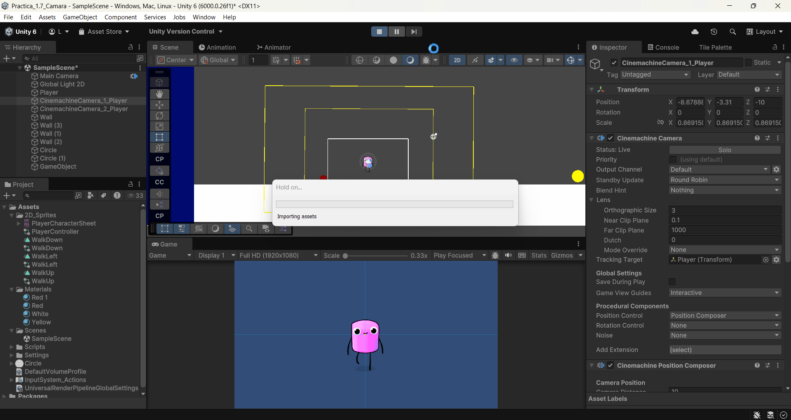
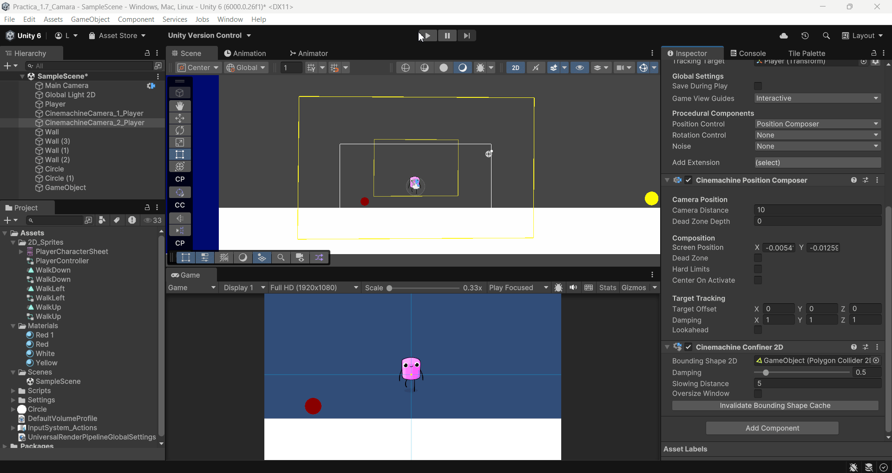

FDV_Camera

```
>> PRACTICA:   Unity Project Camera
>> COMPONENTE: XueMei Lin
>> GITHUB:     https://github.com/XueMei-L/FDV_Camara.git
>> Versión:    1.0.0
```

# Objetivo
En esta práctica vamos a aprender cómo usar Camera en un proyecto de Unity.
Las mécanicas importantes para la cámara en un juego:

* Enfoque en el área de juego: Las cámaras se utilizan para definir el área visible del juego en la pantalla.
* Zoom y enfoque dinámico: Las cámaras permiten aplicar efectos de zoom para
mostrar más detalles o panorámica para resaltar ciertas áreas del juego.
* Transiciones de escena: Las cámaras se usan para crear transiciones suaves entre diferentes escenas o niveles del juego. Esto proporciona una experiencia de juego coherente y atractiva al pasar de un nivel a otro.
* Efectos visuales: sacudidas, desenfoque, distorsiones etc.
* Pantalla dividida: En juegos multijugador o cooperativos, las cámaras se usan para dividir la pantalla en secciones para mostrar las perspectivas de varios jugadores en la misma pantalla

Usarémos Cinemachine para controlar cámara 2D Y 3D.

## 1. Crear un proyecto 2D en unity
## 2. Agregar una cámara con Cinemachine
Hay que instar el paquete de Cinemachine desde PackManager


Crear GameObject Cinemachine, 2D Camera


## 3. Configuración de la cámara virtual

Crear otro GameObject Cinemachine, configuramos las dos cámaras, **Cinemachine 1** solo cambia el tamaño de la cámara, y que la cámara sea más lento de perseguir al jugador.

y la otra cámara **Cinemachine 2**, más grande, y la velocidad normal.

**Cinemachine 1**


Resultado: 

La cámara mueve cuando el personaje está moviendo, pero el personaje se sale de la cámara.



**Cinemachine 2**

Resultado: 

La cámara sigue inmediatamente cuando el jugador se mueve. El jugador no sale de la cámara.




## Zona de confinamiento:

Para que la parte fuera de la mapa no está dentro de la cámara, podemos añadir la extención **Cinemachine Confiner** para evitar esto.

Creamos un GameObject vacío y le agregamos la extensión Cinemachine Confiner. Ahora ya tiene una limitación de cámara. Cuando la cámara llega al borde del objeto vacío no puede seguir a jugador.


Agregamos a **Cinemachine 1** un **chinemachine Confiner 2D** 

Resultado:

Se puede ver que el personaje sale de la cámara y la cámara se para en el limite de GameObject vació.




Hacemos con el **Cinemachine 2** también.

Resultado: 

Pasa lo mismo que el cinemachine 1. Solo que cuando está dentro de la limitación siempre está siguiendo al personaje.



## Seguimiento a un grupo de objetivos:
