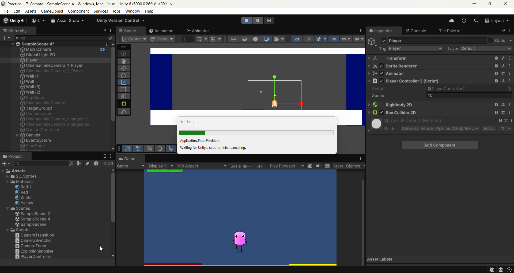

FDV_Camera

```
>> PRACTICA:   imgs/Unity Project Camera
>> COMPONENTE: XueMei Lin
>> GITHUB:     https://github.com/XueMei-L/FDV_Camara.git
>> Versión:    1.0.0
```

# Objetivo
En esta práctica vamos a aprender cómo usar Camera en un proyecto de imgs/Unity.
Las mécanicas importantes para la cámara en un juego:

* Enfoque en el área de juego: Las cámaras se utilizan para definir el área visible del juego en la pantalla.
* Zoom y enfoque dinámico: Las cámaras permiten aplicar efectos de zoom para
mostrar más detalles o panorámica para resaltar ciertas áreas del juego.
* Transiciones de escena: Las cámaras se usan para crear transiciones suaves entre diferentes escenas o niveles del juego. Esto proporciona una experiencia de juego coherente y atractiva al pasar de un nivel a otro.
* Efectos visuales: sacudidas, desenfoque, distorsiones etc.
* Pantalla dividida: En juegos multijugador o cooperativos, las cámaras se usan para dividir la pantalla en secciones para mostrar las perspectivas de varios jugadores en la misma pantalla

Usarémos Cinemachine para controlar cámara 2D Y 3D.

## 1. Crear un proyecto 2D en imgs/unity
## 2. Agregar una cámara con Cinemachine
Hay que instar el paquete de Cinemachine desde PackManager


Crear GameObject Cinemachine, 2D Camera


## 3. Configuración de la cámara virtual

Crear otro GameObject Cinemachine, configuramos las dos cámaras, **Cinemachine 1** solo cambia el tamaño de la cámara, y que la cámara sea más lento de perseguir al jugador.

y la otra cámara **Cinemachine 2**, más grande, y la velocidad normal.

**Cinemachine 1**


Resultado: 

La cámara mueve cuando el personaje está moviendo, pero el personaje se sale de la cámara.


**Cinemachine 2**

Resultado: 

La cámara sigue inmediatamente cuando el jugador se mueve. El jugador no sale de la cámara.


## 4. Zona de confinamiento:

Para que la parte fuera de la mapa no está dentro de la cámara, podemos añadir la extención **Cinemachine Confiner** para evitar esto.

Creamos un GameObject vacío y le agregamos la extensión Cinemachine Confiner. Ahora ya tiene una limitación de cámara. Cuando la cámara llega al borde del objeto vacío no puede seguir a jugador.


Agregamos a **Cinemachine 1** un **chinemachine Confiner 2D** 

Resultado:

Se puede ver que el personaje sale de la cámara y la cámara se para en el limite de GameObject vació.


Hacemos con el **Cinemachine 2** también.

Resultado: 

Pasa lo mismo que el cinemachine 1. Solo que cuando está dentro de la limitación siempre está siguiendo al personaje.


## 5. Seguimiento a un grupo de objetivos:

### 5.1 Agrega varios sprites en la escena que estén realizando un movimiento (mínimo 3). Genera una cámara adicional que le haga el seguimiento a dichos objetos.

Crear un Target Group: **Cinemachine** → Create **Target Group Camera**.
Agreagar más sprites, añadirlos a **TargetGroup1** -> **Targets**


Cree un script para que los sprites nuevos puede mover automaticamente.

Resultado:
Se puede ver que la cámara está manteniendo la posición donde mueven los sprites.


### 5.2 Agrega 2 sprites adicionales en la escena que estén realizando un movimiento Genera una cámara adicional que le haga el seguimiento a dichos objetos, cada uno con un peso en la importancia del seguimiento diferente.

Agregamos otros dos Sprites, añadirlos a **TargetGroupCamera**, cambiamos el peso Weigh de cada uno Sprite.

Resultado:
Se puede ver que la cámara se centra más para el sprite que tiene el peso mayor.


## Impulso:

### Cinemachine Impulse Source: el impulso se genera en respuesta a un evento

Añadir un componente Cinemachine Impulse Source, y crear un script llamado **ExplosionImpulse.cs** con los siguientes códigos.

```
using imgs/UnityEngine;
using imgs/Unity.Cinemachine;

public class ExplosionImpulse : MonoBehaviour
{
    private CinemachineImpulseSource impulseSource;
    
    void Start()
    {
        impulseSource = GetComponent<CinemachineImpulseSource>();
    
    }
    
    void Update()
    {
        if (Input.GetKeyDown(KeyCode.Space))
        {
            impulseSource.GenerateImpulse();
        }
    }
}
```


y añadir a la cámara cinemachine, el componente cinemachine impulse listener


Resultado:

Cuando pulso el teclado space, el componente realiza la acción y la cámara también.


### Cinemachine Collisión Impulse Source: el impulso se genera por una colisión.
Configuramos el circulo, cuando el jugador choca con el circulo, produce cinemachine con efectos:

Añadir a BigCircle:
  * **Ridibody2D**
  * **BoxCollider 2D**
  * **Cinemachine Collision Impulse Source**
dentro del **Cinemachine Collision Impulse Source**, configuramos tipo de impulso y forma de impulso.


y la cámara con el apartado antrior con **Cinemachine Impulse Listener**

Resultado: 


## Zoom
### Implementar un zoom a la cámara del jugador que se controle con las teclas w-s
Para esta parte, crear un script para controlar la cámara: 
W → la cámara se acerca (zoom ++).
S → la cámara se aleja (zoom --).

crear un script y asignar a un **gameobject vacío**, usa **vcam.Lens.OrthographicSize** para controlar el tamaño de la cámara usando w - s

En el script **CameraZoom.cs** he añadido una variable **speed** para que el zoom de la cámara sea más suave.
```
using imgs/UnityEngine;
using imgs/Unity.Cinemachine;

public class SmoothCameraZoom : MonoBehaviour
{
    public CinemachineCamera vcam;   // Arrastra tu Cinemachine Camera aquí
    public float zoomStep = 1f;      // Cuánto cambia por pulsación
    public float zoomSpeed = 5f;     // Qué tan rápido se interpola
    public float minZoom = 3f;
    public float maxZoom = 20f;

    private float targetZoom;        // Valor objetivo del zoom

    void Start()
    {
        // Guardamos el tamaño inicial
        targetZoom = vcam.Lens.OrthographicSize;
    }

    void Update()
    {
        if (vcam == null) return;

        // Detectar entrada de teclado
        if (Input.GetKey(KeyCode.W))
        {
            targetZoom -= zoomStep * Time.deltaTime * 5f; // Suave hacia adentro
        }
        if (Input.GetKey(KeyCode.S))
        {
            targetZoom += zoomStep * Time.deltaTime * 5f; // Suave hacia afuera
        }

        // Limitar rango
        targetZoom = Mathf.Clamp(targetZoom, minZoom, maxZoom);

        // Interpolación suave hacia el valor objetivo
        float currentZoom = vcam.Lens.OrthographicSize;
        float newZoom = Mathf.Lerp(currentZoom, targetZoom, Time.deltaTime * zoomSpeed);

        // Aplicar en una sola línea
        var lens = vcam.Lens;
        lens.OrthographicSize = newZoom;
        vcam.Lens = lens;
    }
}
```

Resultado:


## Intercambiar las cámaras:

### Tarea: Seleccionar un conjunto de teclas que permitan hacer el cambio entre dos cámaras. (Habilitar/Deshabilitar el gameobject de la cámara virtual)
Crear un script para controlar el cambio entre dos cámaras con el teclado c.
y asignar el scirpt a un **Empty GameObject **

```
using imgs/UnityEngine;

public class CameraSwitcher : MonoBehaviour
{
    public GameObject camera1;
    public GameObject camera2;

    private GameObject activeCamera;

    void Start()
    {
        camera1.SetActive(true);
        camera2.SetActive(false);
        activeCamera = camera1;
    }

    void Update()
    {
        // Cambiar cámara con la tecla C
        if (Input.GetKeyDown(KeyCode.C))
        {
            SwitchCamera();
        }
    }

    void SwitchCamera()
    {
        if (activeCamera == camera1)
        {
            camera1.SetActive(false);
            camera2.SetActive(true);
            activeCamera = camera2;
        }
        else
        {
            camera1.SetActive(true);
            camera2.SetActive(false);
            activeCamera = camera1;
        }
    }
}
```


Resultado: 


### Tarea: Implementar una UI que incluya algún elemento para seleccionar que cámara se activa.
Crear un UI Button para controlar el cambio de dos cámaras.
Asignar al button la función en el apartado anterior.


Resultado: 


## Cámara rápida:
### Tarea: Crear un script para activar la cámara lenta cuando el personaje entre en colisión con un elemento de la escena que elijas para activar esta propiedad.

### Tarea: Crear un script para activar la cámara rápida cuando el personaje entre en colisión con un elemento de la escena que elijas para activar esta propiedad.

Creamos dos cámaras una para la cámara lenta y otra para la cámara rápida.
También creamos dos objetos que controla dichas cámaras, cuando el jugador pasa por un objeto activa la cámara lenta y otro activa la cámara rápida.

Asignar a ambos objetos el siguiente script que controla la velocidad de las cámaras
```
using imgs/UnityEngine;
using imgs/Unity.Cinemachine;

public class SimpleTimeZone : MonoBehaviour
{
    public CinemachineCamera effectCam; // Cámara que se activa
    public float timeScale = 1f;        // <1 lento, >1 rápido

    void OnTriggerEnter2D(Collider2D other)
    {
        if (other.CompareTag("Player"))
        {
            effectCam.gameObject.SetActive(true);
            Time.timeScale = timeScale;
        }
    }
}

```

Resultado:


## Transición entre cámaras:

Modificar la prioridad de dos cáramas, una tiene 10 y otra tiene 5.
Crear dos rectangulos en el suelo como zona confinada y normal.
En la zona confinada activa la opción **activate confinada** y la normal no.
Crear un objeto vacío para limitar la "mapa del juego"
En el cídigo, simplemente cambiamos las cámaras cuando pasa un rectangulo u otro.


Resultado: 
